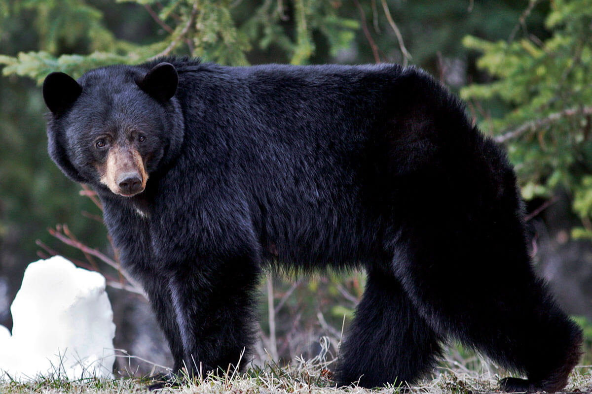

| [**Home**](README.md) | [Habitat](page1.md) | [Diet](page2.md) | [Captivity](page3.md) | [Hibernation](page4.md) |

## The Bears of the World
### About
Bears are a common animal in our minds, but we tend to forget that there's _more_ to bears than a cute Panda, a scary Grizzly, and a white Polar Bear.

From [National Geographic]():
>Bears are mammals that belong to the family Ursidae. They can be as small as four feet long and about 60 pounds (the sun bear) to as big as eight feet long and more than a thousand pounds (the polar bear). They’re found throughout North America, South America, Europe, and Asia.

>They have nonretractable claws, short tails, and excellent sense of smell. They’re typically solitary, except for mothers with cubs.On average, bears can live up to 25 years in the wild and 50 in captivity. Six species, including the polar bear and the giant panda, are included on the IUCN Red List as threatened or vulnerable.

### How Many Species?
There are 8 different species of bear:
1. The North-American Black Bear
2. Brown Bear
3. Polar Bear
4. Asiatic Black Bear
5. Andean Bear
6. Panda Bear
7. Sloth Bear
8. Sun Bear

Learn more at [bearwithus.org](https://bearwithus.org/8-bears-of-the-world/)

### The North-American Black Bear

### Brown Bear
/close-up-view-of-a-mother-brown-bear-standing-over-her-cub-as-they-appear-to-be-looking-out-for-any-danger--kuril-lake--kamchatka--russia--827261734-5b97dfaa46e0fb0050b348af.jpg)
### Polar Bear

### Asiatic Black Bear

### Andean Bear

### Panda Bear

### Sloth Bear

### Sun Bear


---
Some example code:

```
From [National Geographic]():
>Bears are mammals that belong to the family Ursidae.

### The North-American Black Bear

```
