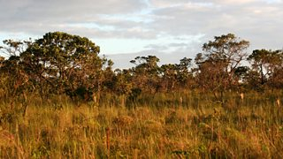

| [Home](README.md) | [**Habitat**](page1.md) | [Diet](page2.md) | [Captivity](page3.md) | [Hibernation](page4.md) |
## Habitat
[Source](https://bearwithus.org/8-bears-of-the-world/) unless specified.

Bears are located all across the world. We tend to think of bears limited to dense forests, but there is much _more_ to it, especially outside of North America.

##

### North-American Black Bear
>The North American Black Bear is the most common bear in North America ranging from the State of Florida north, into Canada and north to Alaska. The black and brown colour phase of the black bear is common. The white colour phase is more rare occuring in north western British Columbia, Canada.

[Animals.net](https://animals.net/black-bear/) says:
> This behavior occurs especially frequently when their habitats are scarce in acorns, tree nuts, and berries. People have found them in
* juniperwoods
* chaparral
* oak forests
* hickory forests
* bays
* swamps
* flatwoods
* hardwood forests
* meadows, and more

### Brown Bear
>The Brown Bear can be found in Alaska, western Canada,and parts of Washington, Montana and Wyoming. Small individual populations are scattered throughout parts of Europe and Asia. Russia has a healthy population of brown bears currently.

>Size varies greatly depending on geographic location and general food availability. The largest bears, the “Big Browns” exist along the coast of Alaska and Russia growing to very large sizes rivaling that of the Polar Bear. The interior bears of the North American Rocky Mountains (Grizzly Bear) and the mountains of Europe tend to be much smaller.
### Polar Bear
>Polar bears live in the Arctic, on ice-covered waters. The total polar bear population is divided into 19 units or subpopulations. Sixty percent of the sub-populations are in Canada.  

[Source](https://www.google.com/url?sa=t&rct=j&q=&esrc=s&source=web&cd=&cad=rja&uact=8&ved=2ahUKEwjf_afCu7jwAhUEOs0KHWigD2YQFjAFegQIDxAD&url=https%3A%2F%2Fwww.worldwildlife.org%2Fstories%2Fwhy-do-polar-bears-have-white-fur-and-nine-other-polar-bear-facts&usg=AOvVaw3lJWj_AtQdcVOAMx7HKNrU)

### Asiatic Black Bear
>Asiatic black bears live in eastern Asia, including Afghanistan, Bangladesh, Bhutan, Cambodia, China, India, Islamic Republic of Iran, Japan, Democratic People’s Republic of Korea, Lao People’s Democratic Republic, Malaysia, Mongolia, Myanmar, Nepal, Pakistan, Russian Federation, Taiwan and Vietnam.

### Andean Bear
>The bears are native to the Andean countries from Venezuela to Bolivia, living in forests, grasslands, and scrublands. Andean bears are true arboreal bears, using their long, sharp front claws to climb and forage for food. As they search for food in the forest, Andean bears live an arboreal lifestyle.

[Source](https://www.google.com/url?sa=t&rct=j&q=&esrc=s&source=web&cd=&cad=rja&uact=8&ved=2ahUKEwjn9ITovLjwAhXDKs0KHaV4CicQFjACegQIAxAD&url=https%3A%2F%2Fanimals.sandiegozoo.org%2Fanimals%2Fandean-spectacled-bear&usg=AOvVaw0sKSt7BrxOpXTRgWR6qqMB)

### Panda Bear
>Pandas live mainly in temperate forests high in the mountains of southwest China, where they subsist almost entirely on bamboo.

[Source](https://www.google.com/url?sa=t&rct=j&q=&esrc=s&source=web&cd=&cad=rja&uact=8&ved=2ahUKEwjml4aKvbjwAhWPB80KHaH0B7EQFjACegQIBRAD&url=https%3A%2F%2Fwww.worldwildlife.org%2Fspecies%2Fgiant-panda&usg=AOvVaw1y8Kn6DXIwGs7xTtZQG_8G)
>Giant pandas live in a few mountain ranges in south central China, in Sichuan, Shaanxi and Gansu provinces. They once lived in lowland areas, but farming, forest clearing and other development now restrict giant pandas to the mountains.  
Giant pandas live in broadleaf and coniferous forests with a dense understory of bamboo, at elevations between 5,000 and 10,000 feet. Torrential rains or dense mist throughout the year characterizes these forests, often shrouded in heavy clouds.

[Source](https://nationalzoo.si.edu/animals/giant-panda)
### Sloth Bear
>Sloth bears live in Sri Lanka, India, Bhutan, Nepal and Bangladesh. Sloth bears are nocturnal and occupy home ranges that they seem happy to share with other sloth bears. Male sloth bears have an average range of 13 square km. This is much smaller than most other bears, probably due to the fact that they do not suffer from seasonal fluctuations of food supply (ants and termites are available all year round).

### Sun Bear
>Sun bears live in south east Asia: Brunei Darussalam, Cambodia, China, India, Indonesia, Lao Peoples Democratic Republic, Malaysia, Myanmar, Thailand and Vietnam.
