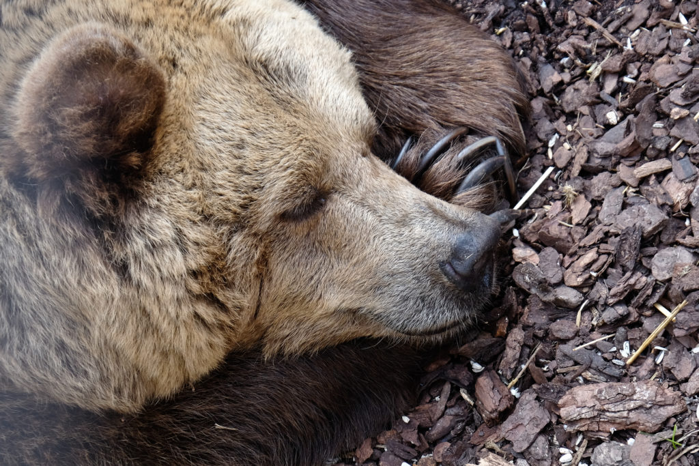

| [Home](README.md) | [Habitat](page1.md) | [Diet](page2.md) | [Captivity](page3.md) | [**Hibernation**](page4.md) |
## Hibernation
Bears are also well known for their characteristic hibernation period. This is defined by:
>when animals “sleep” through the winter season. During hibernation, the animal’s body temperature, heart rate and breathing rate all drop to significantly lower levels. Animals do this to survive the winter because the weather is cold and food is scarce. It is advantageous because these animals can quite literally shut themselves off for weeks at a time rather than try and survive through harsh weather conditions.

However, this is common _misconception_. ([Source](https://www.scienceworld.ca/stories/do-bears-actually-hibernate/))

>they actually participate in a similar, though not exact, practice. Instead of hibernating, bears fall into a deep sleep called **_torpor_**. During torpor...
* heart rate
* breathing rate decreases
* body temperature reduces slightly
* bears do not eat or release bodily waste
>Bears can sleep more than 100 days without eating, drinking, or passing waste! Instead, bears are able to literally turn their pee into protein through a urea recycling process. The urea produced by their fat metabolism is broken down and the nitrogen is re-used by the bear to rebuild protein.

>The main difference between hibernation and torpor is that during torpor, the animal is able to wake up easily if hurt or threatened by predators. Pregnant female bears can also wake up from torpor to give birth, then go back to sleep afterwards!




---
Some example code:
```
this is common _misconception_. ([Source](https://www.scienceworld.ca/stories/do-bears-actually-hibernate/))
```
